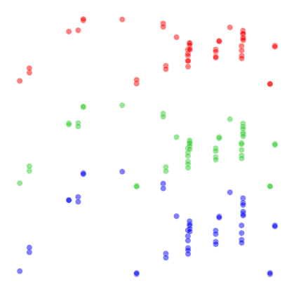
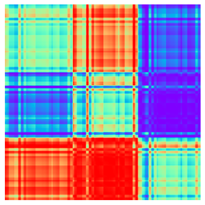
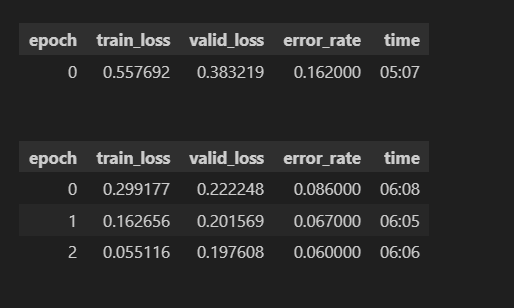
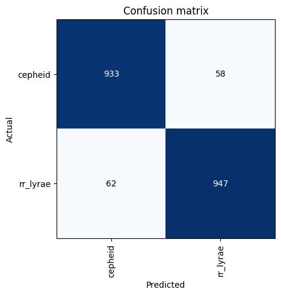
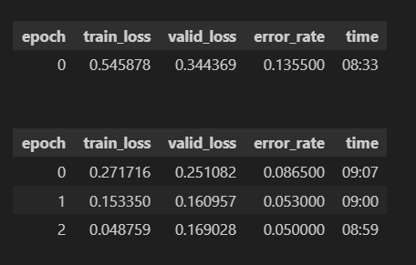
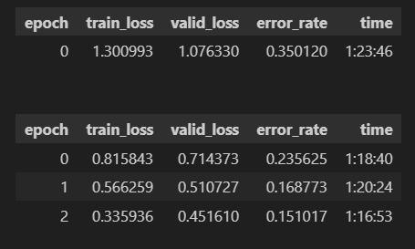
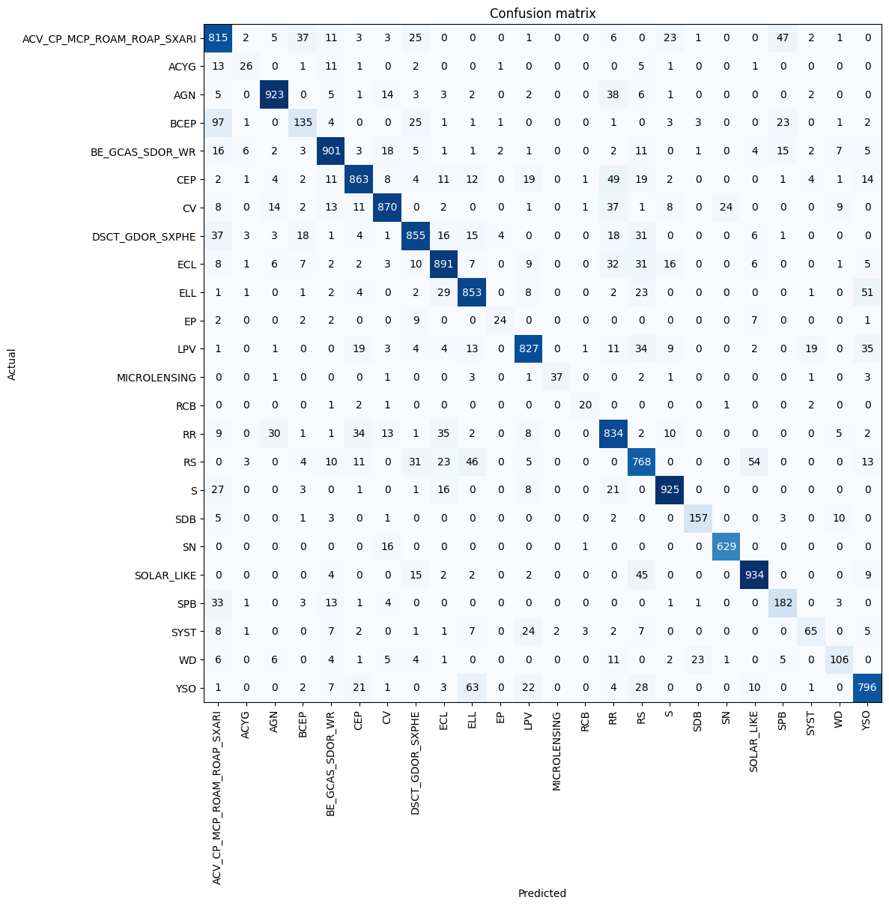
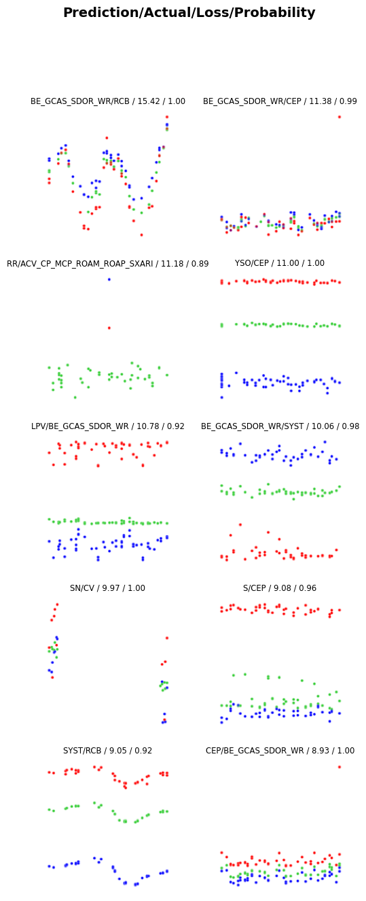

# Gaia Variable Star Classification
In this repository I will look at the data provided by the Gaia satellite (specifically Gaia D3) on variable objects, and create a classification model for variable stars.
The main aim is to learn to use image classification methods.

In the Jupyter notebook titled model.ipynb, you will find the final model.

## Metrics

The metrics below will only be for classification using the plotted light curves and not more complex imaging methods, like GADF (Grammian Angular Difference Frequency).

#### Light curve exmaple

#### GADF example

### Binary - Cepheid vs RR Lyrae
---
The following models were made using fastai. 5000 stars from both classes were picked at random for a total of 10,000 stars. First we show models trained using a smaller model, resnet 18, and then with a larger one, resnet 34. The first row in the metrics is for the model creation, whereas the next three epochs are fine-tuning.

The following models were mde using fastai and resnet18. 5000 stars from both classes were picked at random for a total of 10,000 stars.

### Multiclass - 24 classes
---
Here we use 5000 images for each class, where possible, however 10 of the classes do not have as much data, so we use the maximum amount we have available. 

